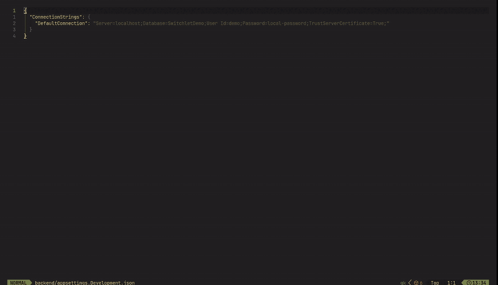

<br />

<h1 align="center">Switchlet</h1>

<p align="center">
  <strong>A terminal profile switcher for repository-local configuration.</strong>
  <br />
  <br />
  <a href="LICENSE"></a>
  <a href="https://github.com/jeppeklh/switchlet/releases/latest"></a>
</p>

<p align="center">
  
</p>

Switchlet applies named profiles to explicitly configured JSON, YAML, TOML, and
dotenv values. It validates before writing and avoids printing raw values in
normal output.

## Installation

### Go

```bash
go install github.com/jeppeklh/switchlet/cmd/switchlet@latest
```

Make sure your Go binary directory, usually `$GOBIN` or `$GOPATH/bin`, is on
your `PATH`.

### GitHub Releases

Download a prebuilt binary for Linux, macOS, or Windows from
[GitHub Releases](https://github.com/jeppeklh/switchlet/releases), then place the
`switchlet` binary somewhere on your `PATH`.

### From Source

```bash
git clone https://github.com/jeppeklh/switchlet.git
cd switchlet
make build
```

This creates `./switchlet` from `./cmd/switchlet`.

## Quick Start

Create project configuration:

```bash
switchlet init
```

Open the interactive profile picker:

```bash
switchlet
```

Common CLI workflows:

```bash
switchlet list
switchlet apply Local --dry-run
switchlet apply Local
switchlet status
switchlet diff Local
```

Edit an existing `.switchlet.yaml`:

```bash
switchlet config
```

## What Switchlet Manages

- Named profiles with one or more target values.
- JSON, YAML, TOML, and dotenv configuration targets.
- Partial profiles that update only included targets.
- Literal values, environment-backed values, and protected profiles.

## Safety Model

- Only explicitly configured targets are modified.
- Target files and selectors are validated before writes.
- File replacements preserve permissions and use same-directory temporary files.
- Protected profiles require confirmation, or `--allow-protected` in
  non-interactive use.
- Normal text and JSON output avoid raw current and replacement values.

## Reference

- [Command reference](COMMANDS.md)
- [Key bindings](KEYBINDINGS.md)

## License

Switchlet is released under the [MIT License](LICENSE).
